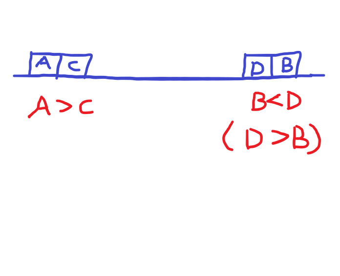

### 代码

``` java
// Space O(n)
class Solution {
    private List<TreeNode> ls = new ArrayList<>();
    
    public void recoverTree(TreeNode root) {
        inorder(root);
        int a = -1, b = -1;
        for (int i = 0; i < ls.size(); i++)
            if (i + 1 < ls.size() && ls.get(i).val > ls.get(i + 1).val) {
                a = a == -1 ? i : a;
                b = i + 1;
            }
        int tmp = ls.get(a).val;
        ls.get(a).val = ls.get(b).val;
        ls.get(b).val = tmp;
    }
    
    private void inorder(TreeNode root) {
        if (root == null)
            return;
        inorder(root.left);
        ls.add(root);
        inorder(root.right);
    }
}

// Space O(logn)
class Solution {
    private TreeNode a, b, prev;
    
    public void recoverTree(TreeNode root) {
        inorder(root);
        // if (a != null && b != null)
            swap(a, b);
    }
    
    private void inorder(TreeNode root) {
        if (root == null)
            return;
        inorder(root.left);
        if (prev != null && prev.val > root.val) {
            a = a == null ? prev : a;
            b = root;
        }
        prev = root;
        inorder(root.right);
    }
    
    private void swap(TreeNode r1, TreeNode r2) {
        int tmp = r1.val;
        r1.val = r2.val;
        r2.val = tmp;
    }
}
```


### 思路

这题的背景类似于求一组逆序对。

首先明确以下几个事实：

* 二叉搜索树不存在值相同的结点
* 不能改变树的结构，即只需交换两个结点的值即可
* 这两个异常结点是一定存在的

我们先从数组的角度出发来理解整个操作逻辑，即按中序遍历的顺序将所有结点都存储到一个数组。那么，正常情况下数组的值应该是按照严格升序排列的，但是出现了一组逆序对，所以会出现两个特异点。不难发现这两个特异点应该如下图所示：



从左往右找，第一个A > C的点A；从右往左找，第一个B < D的点B。则A，B就是两个特异点，交换即可。

为了方便和统一，我们一律按从左往右找的顺序，即**第一个**A > C的点A和**最后一个**D > B的点B。所以比较的对象实际上是当前元素和下一个元素（或者当前元素和前一个元素，都一样）。

通过上面的分析，我们可以得到下面两种方法：

第一种就是按照前面说的，用一个list将结点都存下来。

* 初始化两个特异点的下标a，b为-1，表示无效的位置。
* 遍历数组，同时比较当前值和后一个值。
  * 如果出现 ls.get(i).val > ls.get(i + 1).val 的情况，则：
    * 对于a来说，只在第一次更新，所以判断a是否为-1，如果是则**更新为 i**；否则维持原值。
    * 对于b来说，需要最后一次更新。那么我们让它一直**更新为 i + 1** 就可以了。
* 得到a，b的位置后，交换对应位置结点值即可。

第二种是不需要存储，直接在递归中序遍历的时候记录特异点。

* 初始化两个特异结点a，b为null，然后维护一个prev结点，表示前一个遍历结点。
* 由于递归遍历只能获得遍历过的前一个结点，不能获得后一个结点，所以这里我们用当前值和前一个值比较。
  * 如果出现 prev.val > root.val 的情况，则：
    * 对于a，判断a是否为null，如果是则更新为prev，否则不变。
    * 对于b，直接更新为root。
  * 每次遍历结点结束时要**更新prev = root**，不能忘了。

这里需要注意一个误区，就是中序遍历的时候，root的前一个结点并不一定是root.left，而后一个结点并不一定是root.right。所以我们不能通过root.left来获取前一个结点，只能通过一个额外的指针prev来记录。

最后我们分析一下两种方法的空间复杂度：

首先明确一点递归中序遍历的空间复杂度是O(h)，h是树的高度。这一点比较隐晦，实际上我们用迭代的方式去展开这个递归就会发现，整个过程需要用到栈，栈的最大占用空间就是O(h)，即O(logn)。

那么第一种方法由于又多了O(n)的存储空间，所以总的复杂度为O(n)；第二种则为O(logn)。


### 总结

题目提到最优的解法空间复杂度为O(1)，这种解法需要用到Morris（中序）遍历的模板，这里就不细说了。


