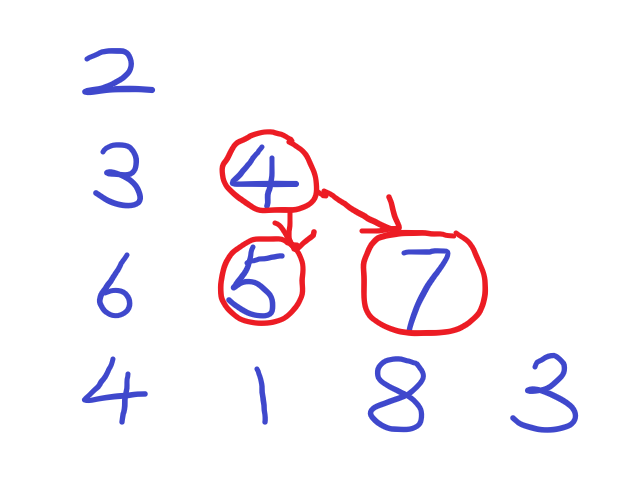

``` java
class Solution {
    public int minimumTotal(List<List<Integer>> triangle) {
        int m = triangle.size(), n = triangle.get(m - 1).size();
        int[] dp = new int[n];
        for (int i = 0; i < n; i++) // 初始化为最底层
            dp[i] = triangle.get(m - 1).get(i);
        for (int i = m - 2; i >= 0; i--)
            for (int j = 0; j < triangle.get(i).size(); j++)
                dp[j] = Math.min(dp[j], dp[j + 1]) + triangle.get(i).get(j);
        return dp[0];
    }
}
```

要理解这个三角形结构，把它摆正，其实就相等于二维数组的下半三角部分，如图：



如果我们用dp(i, j)表示从 i 行 j 列的数出发，向下到达底层的最小路径和。则根据题目”只能走相邻数字“的规则，有如下动态转移方程：dp(i, j) = Math.min(dp(i + 1, j), dp(i + 1, j + 1)) + triangle(i, j)。考虑到该方程实际只涉及两行，所以可以用两个数组完成，一个存新dp，一个存旧dp。再狠一些，可以只用一个数组完成，即：

**dp(j) = Math.min(dp(j), dp(j + 1)) + triangle(i, j)**。这样直接在原数组上覆盖并不会影响后面dp的计算，因为覆盖的都是已经遍历过且不再需要的值。我们可以将dp数组**初始化**为三角形的**最后一行**，然后就可以**自底向上**（bottom-up）去不断更新dp。停止更新后，**dp(0)**，即第0行0列，就是我们要求的从最上方开始到最底层的最小路径和。

最后注意一下dp过程中的更新顺序。因为我们是自底向上更新的，所以外层for应该是迭代行数 i，而内层for迭代列数 j。这里再说一下更新顺序的问题，如图：


可以看到两者都要自底向上更新。但是绿色的那种必须要从右往左更新，因为右边的数是未知的，要根据下边和再右边的更新出来；而蓝色的那种左右顺序无所谓，因为都是根据低一层的更新出来，而低一层的是已知的。这里我们dp的情况是蓝色那种，为了让覆盖不影响到后面数的计算，自然要选择**从左到右更新**。

此外，遇到这种路径dp的问题，最好自底向上考虑，即**确定终点**，从不同位置的**起点进行dp**。得到的是某个起点到终点的路径。

