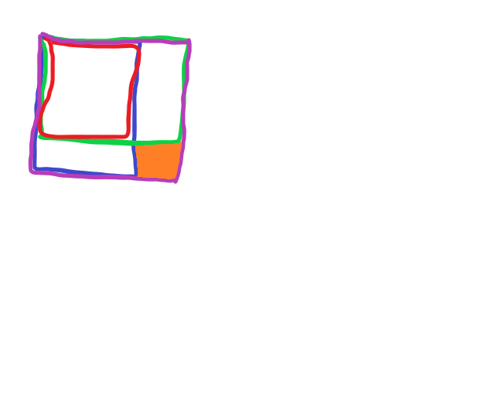

``` java
// 1D
class NumArray {

    private int[] dp = null;
    
    public NumArray(int[] nums) {
        if (nums.length == 0)
            return;
        dp = new int[nums.length];
        dp[0] = nums[0];
        for (int i = 1; i < nums.length; i++)
            dp[i] = dp[i - 1] + nums[i];
    }
    
    public int sumRange(int i, int j) {
        if (dp == null)
            return 0;
        return i == 0 ? dp[j] : dp[j] - dp[i - 1];
    }
}
```

首先需要在构造方法里做预处理。核心是做一个dp，dp(i)表示从[0, i]的元素和。

那么区间[i, j]的和，可以表示为：如果 **i == 0**，则直接为**dp(j)** ; 否则，为**dp(j) - dp(i - 1)**。

这里注意两个易错的地方：**nums长度为0**和区间**下界 i 为0**，都涉及到了数组下标，不考虑周全会越界。

------

``` java
// 2D
class NumMatrix {

    private int[][] dp = null;

    public NumMatrix(int[][] matrix) {
        int m = matrix.length;
        if (m == 0)
            return;
        int n = matrix[0].length;
        if (n == 0)
            return;
        dp = new int[m][n];
        dp[0][0] = matrix[0][0];
        for (int i = 1; i < n; i++)
            dp[0][i] = dp[0][i - 1] + matrix[0][i];
        for (int i = 1; i < m; i++)
            dp[i][0] = dp[i - 1][0] + matrix[i][0];
        for (int i = 1; i < m; i++) {
            for (int j = 1; j < n; j++) {
                dp[i][j] = dp[i - 1][j] + dp[i][j - 1] - dp[i - 1][j - 1] + matrix[i][j];
            }
        }
    }
    
    public int sumRegion(int row1, int col1, int row2, int col2) {
        if (dp == null)
            return 0;
        int s1, s2, s3, s4;
        s1 = row1 == 0 ? 0 : dp[row1 - 1][col2];
        s2 = col1 == 0 ? 0 : dp[row2][col1 - 1];
        s3 = row1 == 0 || col1 == 0 ? 0 : dp[row1 - 1][col1 - 1];
        s4 = dp[row2][col2];
        return s4 - (s1 + s2 - s3);
    }
}
```

和上题流程类似，只不过换成了2D矩阵。构造方法里做二维dp，dp(i, j)表示从[0, 0]到[i, j]形成矩形的元素和。dp方程为：dp\[i - 1][j] + dp\[i][j - 1] - dp\[i - 1][j - 1] + matrix\[i][j]。至于为什么这么写，等一下分析sumRegion的时候会说明。初始化要额外考虑第0行和第0列。

得到dp数组后，对于[row1, col1]和[row2, col2]形成矩形元素和的计算，可参考下图，分成**4部分计算**。我们的目标是橙色区域，可以通过：S紫 - (S绿 + S蓝 - S红) 得到。而上面的方程，是已知S橙（matrix\[i][j]），求S紫，所以一目了然。

同时还是要注意越界的问题，包括**m == 0 或 n == 0**，以及左上角位置**row1 == 0 || col1 == 0**。

