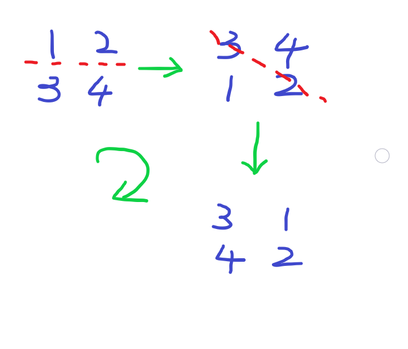

### 代码

``` java
import java.util.*;

class Solution {
    public void rotate(int[][] matrix) {
        int n = matrix.length;
        int i = 0, j = n - 1;
        while (i < j) {
            for (int k = 0; k < n; k++) {
                swap(matrix, i, k, j, k);
            }
            i++; j--;
        }
        for (i = 0; i < n; i++)
            for (j = 0; j < i; j++)
                swap(matrix, i, j, j, i);
    }
    
    private void swap(int[][] mat, int y1, int x1, int y2, int x2) {
        int tmp = mat[y1][x1];
        mat[y1][x1] = mat[y2][x2];
        mat[y2][x2] = tmp;
    }
}
```


### 思路



顺时针将矩阵旋转90°，可以分成两步来做。

* 上下（行）翻转。
  * 像这种**颠倒交换**的问题，可以用**双指针**做，更方便些。
* 以左上角到右下角的对角线为轴翻转。
  * 这里我们只考虑下三角部分（不包含对角线），对于行列坐标为 (i, j) 的元素来说，它对称的位置应该是(j, i)。即将这两个位置的数交换即可。


### 总结

稍微拓展一下，逆时针旋转90°应该怎么做。

``` java
private void rotate_counter(int[][] matrix) {
    int n = matrix.length;
    for (int i = 0; i < n / 2; i++)
        for (int j = 0; j < n; j++)
            swap(matrix, i, j, n - 1 - i, j);
    for (int i = 0; i < n; i++)
        for (int j = 0; j < n - 1 - i; j++)
            swap(matrix, i, j, n - 1 - j, n - 1 - i);
}

private void swap(int[][] mat, int y1, int x1, int y2, int x2) {
    int tmp = mat[y1][x1];
    mat[y1][x1] = mat[y2][x2];
    mat[y2][x2] = tmp;
}
```

也是分两步。

* 上下翻转，同逆时针版本。
* 以右上角到左下角的对角线为轴翻转。
  * 这里我们考虑上三角部分（不包含对角线）。对于第 i 行来说，列的范围是[0, n - 1 - i）。对于行列坐标为 (i, j) 的元素来说，它对称的位置应该是(n - 1 - j,  n - 1 - i)。即将这两个位置的数交换即可。(如果不清楚对应关系的话，可以用一个4 x 4的矩阵找找规律)

其实可以用逆时针连续旋转3次得到顺时针的结果（变相地检验代码正确性 XD），同理顺时针连续旋转3次也能得到逆时针的结果。


