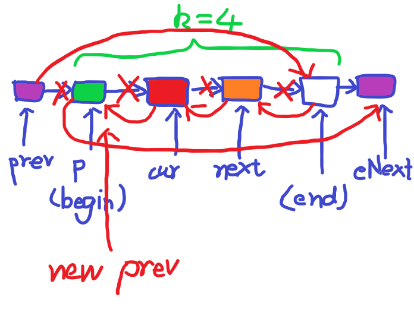

### 代码

``` java
// Swap Nodes in Pairs 
// 奇链插入偶链
class Solution {
    public ListNode swapPairs(ListNode head) {
        if (head == null || head.next == null)
            return head;
        ListNode h1, t1, h2, t2, p, q;
        h1 = t1 = new ListNode(0);
        h2 = t2 = new ListNode(0);
        boolean flag = true;
        p = head;
        while (p != null) {
            if (flag) {
                t1.next = p;
                t1 = p;
            }
            else {
                t2.next = p;
                t2 = p;
            }
            flag = !flag;
            p = p.next;
        }
        t1.next = null;
        t2.next = null;
        p = h2.next;
        q = h1.next;
        while (p != null) {
            if (p.next == null) {
                p.next = q;
                break;
            }
            else {
                ListNode np = p.next;
                ListNode nq = q.next;
                p.next = q;
                q.next = np;
                p = np;
                q = nq;
            }
        }
        return h2.next;
    }
}

// 2-Group写法
class Solution {
    public ListNode swapPairs(ListNode head) {
        if (head == null || head.next == null)
            return head;
        ListNode dummy = new ListNode(0), prev, cur;
        dummy.next = head;
        prev = dummy;
        cur = head;
        while (cur != null) {
            cur = cur.next;
            if (cur == null)
                break;
            // Reverse
            ListNode eNext = cur.next;
            cur.next = prev.next;
            // Link
            prev.next = cur;
            cur.next.next = eNext;
            // update
            prev = cur.next;
            cur = eNext;
        }
        return dummy.next;
    }
}
```


### 思路

刚开始的写法我自己都看不下去了，太繁琐了。就是分出两个小链表，一个存奇数结点，另一个存偶数结点。然后把奇数结点插入偶数结点（类似链表合并）。一共用了3次尾插，太麻烦了。

第二种2-Group写法是我根据下面k-Group的模板改的，由于情况比较简单，所以可以做一些适度的简化和省略。


### 总结

除了迭代外，还有递归的写法。这里先挖个坑，有空复刷的时候再来更新。


<hr>

### 代码

``` java
// Reverse Nodes in k-Group
// Group内部头插 + 尾插Groups
class Solution {
    public ListNode reverseKGroup(ListNode head, int k) {
        if (head == null || head.next == null || k < 2)
            return head;
        
        ListNode h, t, p;
        h = t = new ListNode(0);
        p = head;
        
        while (p != null) {
            ListNode gHead, gTail;
            gHead = gTail = null;
            int cnt = 0;
            while (p != null && cnt < k) {
                if (cnt == 0)
                    gTail = p;
                ListNode next = p.next;
                p.next = gHead;
                gHead = p;
                p = next;
                cnt++;
            }
            gTail.next = null;
            if (cnt == k) {
                t.next = gHead;
                t = gTail;	//注意移动tail
                gTail.next = p;
            }
            else {
                ListNode tp = gHead, rHead = null;
                while (tp != null) {
                    ListNode next = tp.next;
                    tp.next = rHead;
                    rHead = tp;
                    tp = next;
                }
                t.next = rHead;
                t = gHead;	//注意移动tail
            }
        }
        
        t.next = null;
        return h.next;
    }
}

// 直接修改next指向（推荐）
class Solution {
    public ListNode reverseKGroup(ListNode head, int k) {
        if (head == null || head.next == null || k < 2)
            return head;
        ListNode dummy = new ListNode(0);
        dummy.next = head;
        ListNode prev = dummy, cur = head;
        while (cur != null) {
            int cnt = 0;
            while (cur != null && cnt < k - 1) {
                cur = cur.next;
                cnt++;
            }
            if (cur == null)
                break;
            // Update
            prev = reverse(prev, prev.next, cur);
            cur = prev.next;
        }
        return dummy.next;
    }
    
    private ListNode reverse(ListNode prev, ListNode begin, ListNode end) {
        ListNode eNext = end.next;
        ListNode p = begin, cur = p.next, next = cur.next;
        // Reverse
        while (cur != eNext) {
            cur.next = p;
            p = cur;
            cur = next;
            next = cur == null ? null : cur.next;
        }
        // Link
        prev.next = end;
        begin.next = eNext;
        return begin;
    }
}
```


### 思路

很容易发现Swap Nodes in Pairs是Reverse Nodes in k-Group的特殊情况，即当区间长度k = 2时。

这题我一开始的做法比较粗暴，就是相当于每次头插法反转一个区间，然后把这个区间尾插续到新构造的链表后面......循环往复。如果是最后一段长度不足k的话，因为先进行了头插反转，所以还要再用一次头插反转回来= =。这个方法其实虽然直接但是繁琐。这里记录的原因是因为发现了尾插法使用过程中的一些问题：

* 尾插过程中tail也要跟着一起**移动更新**。这里由于尾插的是一个区间而不仅仅是一个结点，所以tail要直接移动到区间的末尾。而原来的话tail是直接移动到插入的结点或者直接tail = tail.next;
* 并不是所有情况都要断尾。即**不能无脑滥用**。断尾的前提是必须确定tail所在的这个结点真的就是链表尾巴了，后面再不需要有其他东西。此时可以设置tail.next = null; 除此之外，如果后面还连着其他结点，直接断尾相当于丢失了这些结点。
* 如果确定tail接的是最后一段链表了（且最后一个结点指向null），可以直接连接就行，不需要再移动tail或者断尾。

然后是关于头插和尾插的性能分析。实际上这两个的时间复杂度都是O(2n)。因为实际上相当于先遍历了原链表（的一部分），然后在遍历了一遍头插/尾插链表（的一部分），即一共遍历了2次。所以，最快的方法就是直接在遍历的时候修改结点间的指向关系，即one-pass。所以有了推荐的方法：

* 特殊情况。这几种情况下反转是不存在的，可以直接返回head。
  * 空链表，即head == null。
  * 一个结点的链表，即head.next == null。
  * k = 1。
* 维护两个指针prev和cur。既然用到了prev，就需要新建一个dummy头结点。特别要记住的是**dummy必须指向head**，千万不能漏，否则就没有意义了。
  * prev连接的是一个个反转的区间，作用类似于tail。
  * cur遍历原链表，更具体点说是定位区间。
* while cur != null
  * 维护一个计数器cnt，统计遍历过的结点数目，初始化为0。
  * 从cur开始遍历，直到cur == null或者cnt < **k - 1**停止。cnt < k - 1的目的是让cur跳k - 1步，这样确保得到的区间刚好是k个结点，注意不是cnt < k。
    * 中途更新cur和cnt。
  * 如果cur == null，说明要么提前终止了，cnt不足k - 1。要么cnt刚好到k - 1，但是cur为null，此时cur表示区间最后一个结点，它为null的话说明区间肯定不足k个。综上，**cur == null**表示我们刚刚遍历的区间是最后一个，且长度不足k，所以直接可以break终止。
  * cur != null时，反转刚刚遍历的区间。很明显区间右端是cur，那么左端呢？左端可以根据prev获得。这里根据我们后面的算法，会让prev始终指向下一个区间的左端（一开始也是对的，因为开始prev.next == head，head就是第一个区间的左端）。即左端为prev.next。综上，这个区间是**[prev.next, cur]**。
  * 调用reverse方法，反转区间。然后根据reverse方法返回的结点位置更新prev，同时更新cur。cur就是新的prev的next。即 **reverse + link + update** 3步走。
* 最后返回新的头结点dummy.next

接下来重点总结reverse这个方法的模板，用于反转一个区间（**至少有两个结点**）：

* 参数。

  * 区间位置[begin, end]，由于至少有2个结点，所以begin ≠ end。
  * 另外我们并不是单独考虑这个区间本身，最终目的还是要把它和其他结点连接起来，所以传入一个prev位置，prev用于连接反转后的区间。

* 返回值。

  * 要返回更新后的prev值，这样prev才能用于连接下一个区间，所以prev这个位置应该指向反转后区间的末尾，即原区间begin的位置。综上，应该返回begin。

* 内容。

  * 先记录end的下一个结点，记为eNext，用途后面会讲。由于end有效，所以可以直接进行.next操作。
  * 反转是一个遍历区间的过程，需要维护3个指针：
    * prev（为防止引起歧义，用p代替）。表示cur的前一个位置。初始化为begin。
    * cur，当前指针位置。初始化为prev.next。
    * next，cur的后一个位置。用于更新cur。初始化为cur.next。
  * 反转的核心是让当前指针指回前一个指针，这也是我们为什么让cur从begin的下一位开始的原因。即cur.next = p。另外，反转结束的条件是cur == eNext，类似于cur == null终止。
  * 一轮反转结束后更新这3个指针。按从前到后的顺序，不能乱。
    * p = cur;
    * cur = next;
    * next = cur.next。注意这里不保证cur不为null，所以要判断。如果cur为null，则直接设置为null。
  * 所有反转完成后，让prev指向新的区间头，即end；让begin指向下一个新的区间（未反转）的头，即eNext。同时需要让prev更新为begin，返回新的prev，即begin。

  下面用一张图形象地说明整个过程：

  

  最后总结一下代码的模板，凡是涉及到反转的都可以用这个模板：

  ``` java
  private ListNode reverse(ListNode prev, ListNode begin, ListNode end) {
      ListNode eNext = end.next;
      ListNode p = begin, cur = p.next, next = cur.next;
      while (cur != eNext) {
          cur.next = p;
          p = cur;
          cur = next;
          next = cur == null ? null : cur.next;
      }
      prev.next = end;
      begin.next = eNext;
      return begin;
  }
  ```


### 总结

实际上，反转那部分继续用头插也是可以的，但是确实会慢一点。此外，还有递归版本的写法，而且写法上似乎比迭代还要简单，后续有空再更。

``` java
class Solution {
    public ListNode reverseKGroup(ListNode head, int k) {
        if (head == null || head.next == null || k < 2)
            return head;
        ListNode dummy = new ListNode(0);
        dummy.next = head;
        ListNode prev = dummy;
        ListNode cur = head;
        while (cur != null) {
            int cnt = 0;
            ListNode start = prev.next;
            while (cur != null && cnt < k - 1) {
                cur = cur.next;
                cnt++;
            }
            if (cur == null)
                break;
            // 头插反转
            ListNode next = cur.next;
            ListNode p = start, h = null;
            while (p != null && p != next) {
                ListNode tmp = p.next;
                p.next = h;
                h = p;
                p = tmp;
            }
            // 连接 + 更新
            prev.next = cur;
            start.next = next;
            cur = next;
            prev = start;
        }
        return dummy.next;
    }
}
```


